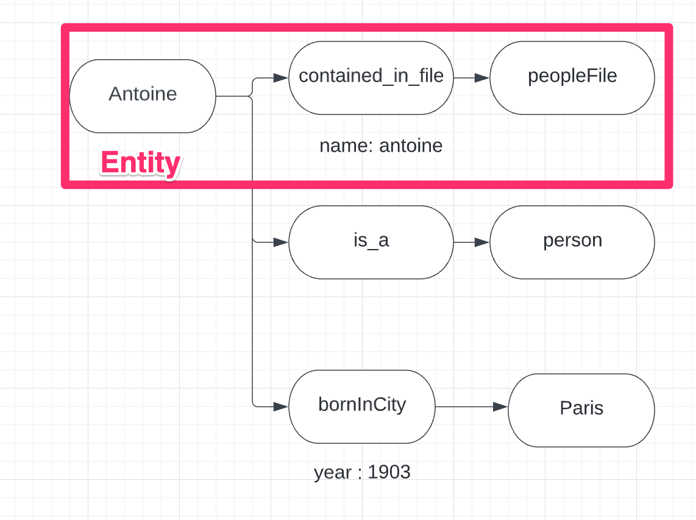
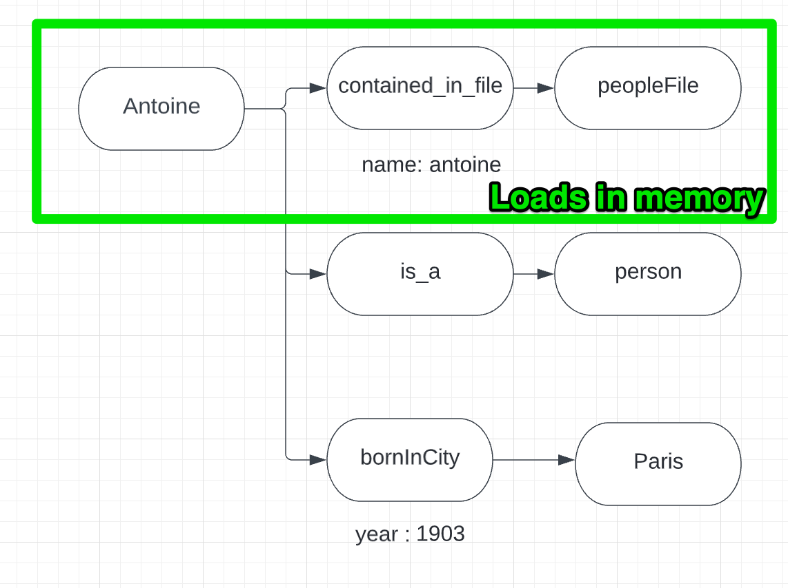
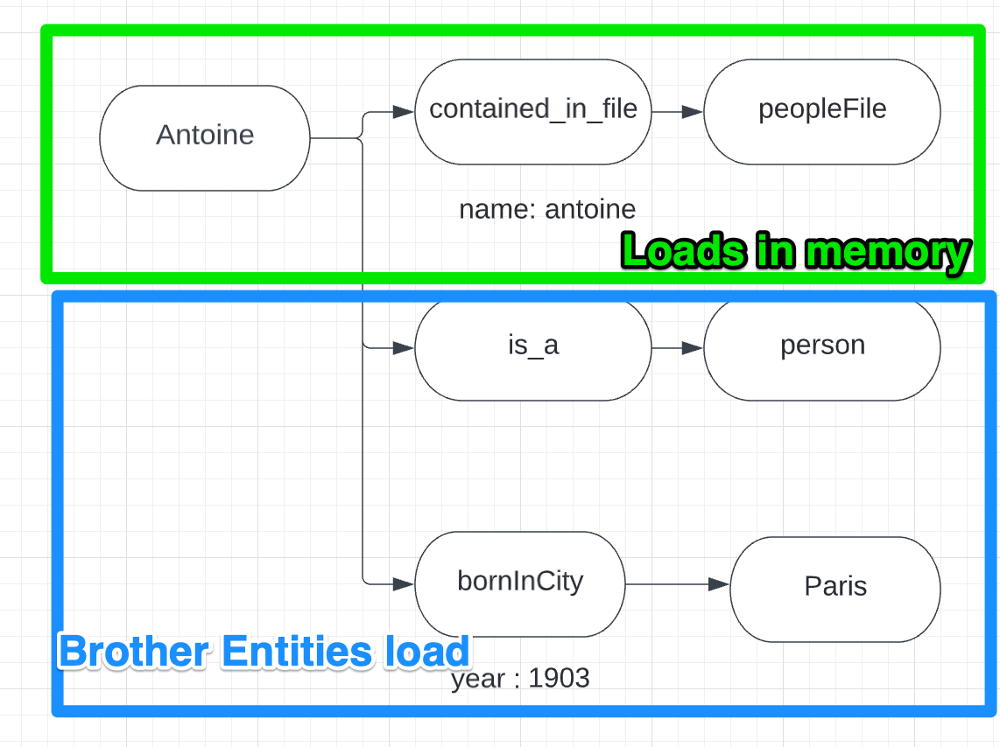
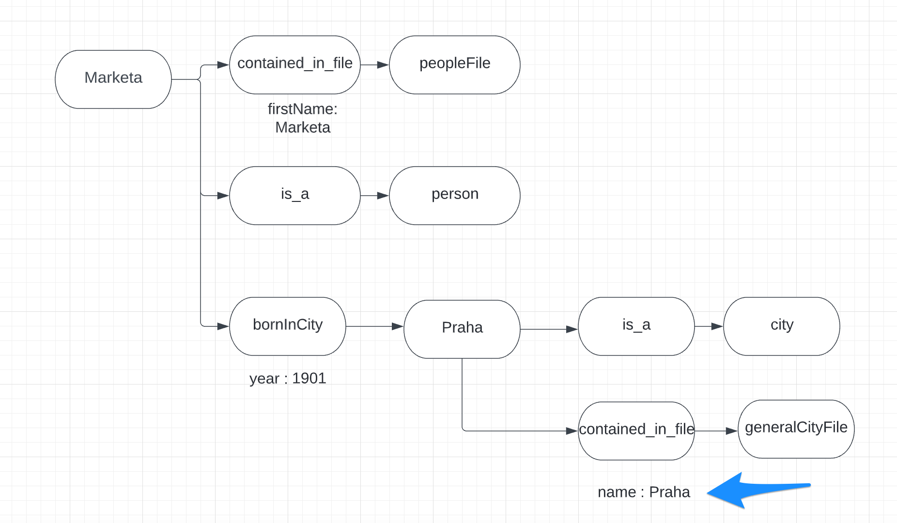

For this exercises you will need to use some homebrew methods to go through 
the datagraph.

####Entity

An entity is defined by the relation of a triple and its associated references.
For example

Antoine - contained_in_file - peopleFile (triplet)

firstName : Antoine (Reference)

In the PHP object Entity we can access the data

Assuming $antoine is an object of type Entity

`$antoine->get('name')`;

Will return the reference value : antoine

To modify or write a new reference on this entity
`$antoine->createOrUpdateRef('name','Antonio');` 

will modify the name

`$antoine->createOrUpdateRef('lastName','Dupont');`
Will add a new reference lastName

It's possible to access triplet data this way

`$antoine->subjectConcept->idConcept ` Will return the concept id of Antoine

`$antoine->verbConcept->idConcept ` Will return the concept id of the verb "contained_in_file"

`$antoine->targetConcept->idConcept ` Will return the concept id of the target "people file"

`$antoine->entityId ` Will return the entity id

If you need to get the shortname of a concept for example 'contained_in_file'

`$antoine->verbConcept->getShortname()`

#### Brother Entity

Two entities are considered "brother" as long as they share the same subject for example

Antoine - contained_in_file - peopleFile (Entity)

Antoine - bornInCity - Paris (Entity)

The two entities a considered as brother as they share the same subject "Antoine".
Note even data refer to the same person they are two distict entities.

We can create new brother entities from any object of type Entity

set brother entity expect a verb a target and an array of references key values

`$antoine->setBrotherEntity('playInstrument','piano',['since'=>1940]);`

Note in general method in sandra core expecting concepts accept parameters that are either
string (it get or create a concept id with the shortname string) a int (concept id) or an object of type Entity (then 
it will take the concept subject concept id) For example

`$antoine->setBrotherEntity('loves',$antoine,[]);`

Antoine - loves - Antoine

`$antoine->setBrotherEntity($antoine->subjectConcept->idConcept,$antoine,[]);`

Antoine - Antoine - Antoine

#### EntityFactory

The entity factories are used to create AND load entities from the datagraph

`$peopleFactory = new EntityFactory('person','peopleFile',$sandra);`

This factory will create or read people entities everytime with two triplets

XXX - is_a - person
XXX - contained_in_file - peopleFile

#### Creation

#### Read
In order to load entities we need to use populateLocal method

`$peopleFactory->populateLocal()`

This will load into memory all entities that are contained_in_file - peopleFile and have a is_a relation

`$peopleFactory->dumpMeta()`
This will return an array of factory data and elements.

`$antoine = $peopleFactory->last('name','Antoine');`
This will return the last Entity that has "name" Antoine

From there we cannot access the info born in City from our subject antoine
To be able to access those data we need to load brother entities

`$peopleFactory->populateBrotherEntities()`

This we can access the born year on the brother entity

        $arrayOfEntities = $antoine->getBrotherEntitiesOnVerb('bornInCity');

        //assuming it has a born in city relation
        if (!empty($arrayOfEntities)){
            $bornIn = end($arrayOfEntities); //last entity of the array (it may have multiple bornInCity relation
           echo $bornIn->get('year'); // will return 1902
        }

Or another way 

    $arrayOfStrings = $antoine->getBrotherReference('bornInCity',null,'year');

#### Joined Factories

We can explore the datagraph by joining factory on target concepts in this case we want to access the city
name where a person has a bornInCity relation

    //we create a city factory
    $cityFactory = new EntityFactory('city','generalCityFile',$sandra);

    //we join the city factory on the bornInCity verb

    $peopleFactory->joinFactory('bornInCity',$cityFactory);
    $peopleFactory->joinPopulate();

    $marketa = $peopleFactory->last('name','Marketa');
    $city = $marketa->getJoinedEntities('bornInCity');

This will return the entity

Praha - contained_in_file - generalCityFile

#### Advices

We are aware that the exercises are advanced in difficulty. Some suggestions

1. For these exercises we advise you to make a schema of the datagraph on a paper (or else) to clearly see 
the data loaded with populateBrotherEntities and joinPopulate.
   
2. There are multiple ways of loading part of data of factories to optimize memory usage. But for these exercise
we advise you load full data systematically. After you instanciate a factory systematically do a
   `$factory->populateLocal()` and `$factory->populateBrotherEntities()` to make sure all data is loaded. If the factory 
   is intended to be joined then do  `$baseFactory->joinFactory('verbToJoin',$joinedFactory)` `$baseFactory->joinPopulate()`
   `$joinedFactory->populateBrotherEntities()`
   

   

