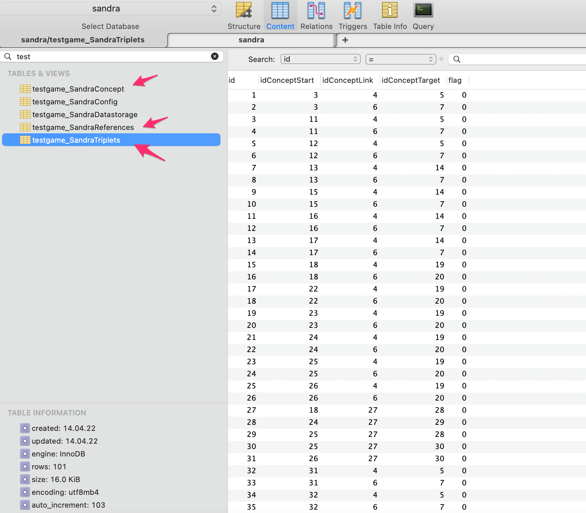
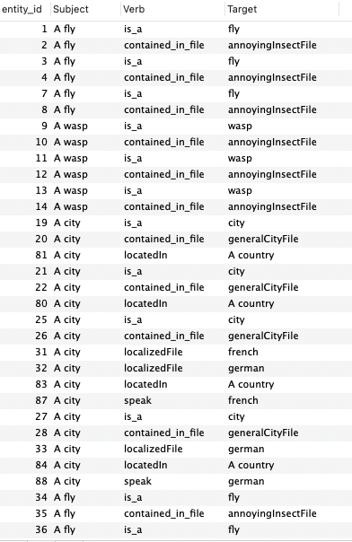
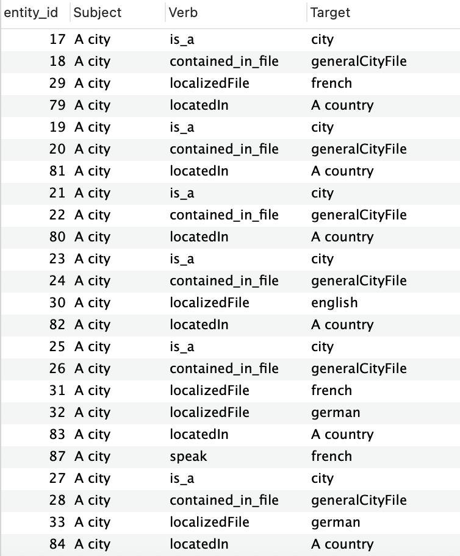

## Setup

Make sure you have a working PHP7 or PHP8 local environment with composer
Make sure you have a local Typescript running environement
Make sure you have local MySQL database

Checkout this project. 

Make a copy of .env.example and rename it .env
modify the field to give access to your database

`DB_PORT=3306`

`DB_DATABASE=sandra`

`DB_USERNAME=root`

`DB_PASSWORD=`

Then run

`composer update`

Then run
`php artisan test:start`

This will create or empty the required table and
add data. Take a look at the file 

app/Console/Commands/Game.php

You will see datagraph is initialized with some data take look 
athe the code to understand relations created.

Take a look at the tables generated and the data structure

copy the folder app/yourNameExercise and rename it with your name. Then modify the file for the exercises

##  SQL

###  Exercice 1

Write an SQL query returning testgame_SandraTriplets table with instead concepts id foreign keys
in testgame_SandraConcept, the column "shortname" of the concept IF exists otherwise the 
column "code". See the following image as expected result 

###  Exercice 2

From previous query filter in order NOT to display any annoying insect related triplet

### Laravel

If you are not familiar with laravel and you would like to just run your code you can
use the console command file
`app/Console/Commands/TestGameExecute.php`
and run it through the console by doing

`testgame:execute`

you can simply modify the class used to point to your own class namespace

        namespace App\Console\Commands;

        use App\yourNameExercise\MainExercises; //modify
        use Illuminate\Console\Command;

##  PHP

We are going to use the library SandraCore to make some data queries on the datagraph.
The goal is to display country and city names in a preferred language.

We are going to "simply" display all the cities with their respective country. 
The catch is some cities and country names are localized in certain languages.
By default we display the name in english. If a specific language is defined we display the name in
the defined language if available if not we display english localization or the default name.

###  Exercice 3

Write a script that will return an array of strings of all the cities with their respective countries

    Array
    (
    [0] => London - United Kingdom

    [1] => Delhi - India

    [2] => Paris - France

    [3] => Prague - Czech Republic

    [4] => Geneva - Switzerland

    [5] => Zurich - Switzerland

    )

###  Exercice 4

This time same as exercice 1 but we pass an entity for favorite language
it could be a person, a city or a country.
If a person can be defined directely as speak - language but if not we are looking if the 
person is born in a certain city. Then the city might speak a language. If the city language is not
defined then we look at the city's country language.

##  Typescript

###  Bonus Exercise 5

Create a front end application allowing to list the content of localized
file and allow to modify or add new translations for cities and countries. It should be also possible 
to add new language. We should be able to define new relations for a person a city or a country the same way we do via code

`$kurt->setBrotherEntity('speak','german',array());`

For this exercices you can use Laravel routes controller as API. you can launch an API server
with 

`php artisan serve`

It will create a server http://127.0.0.1:8000 where you can create GET and POST requests

